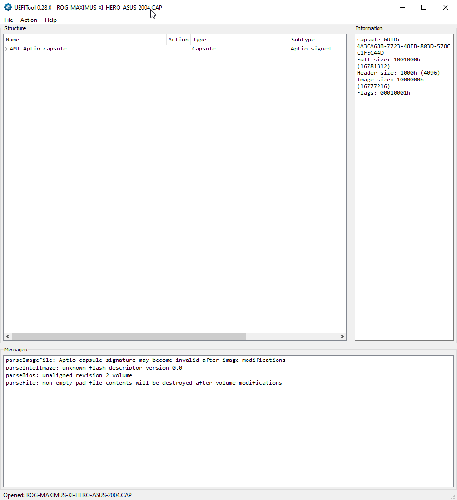
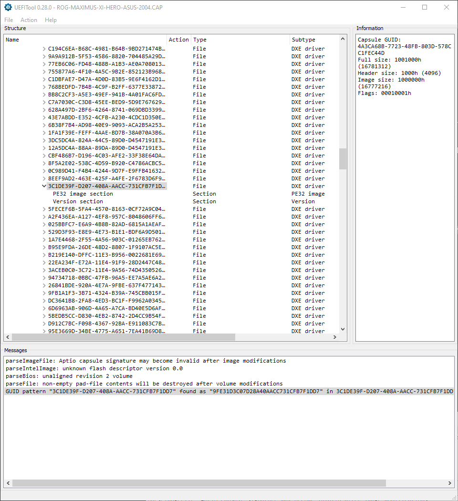
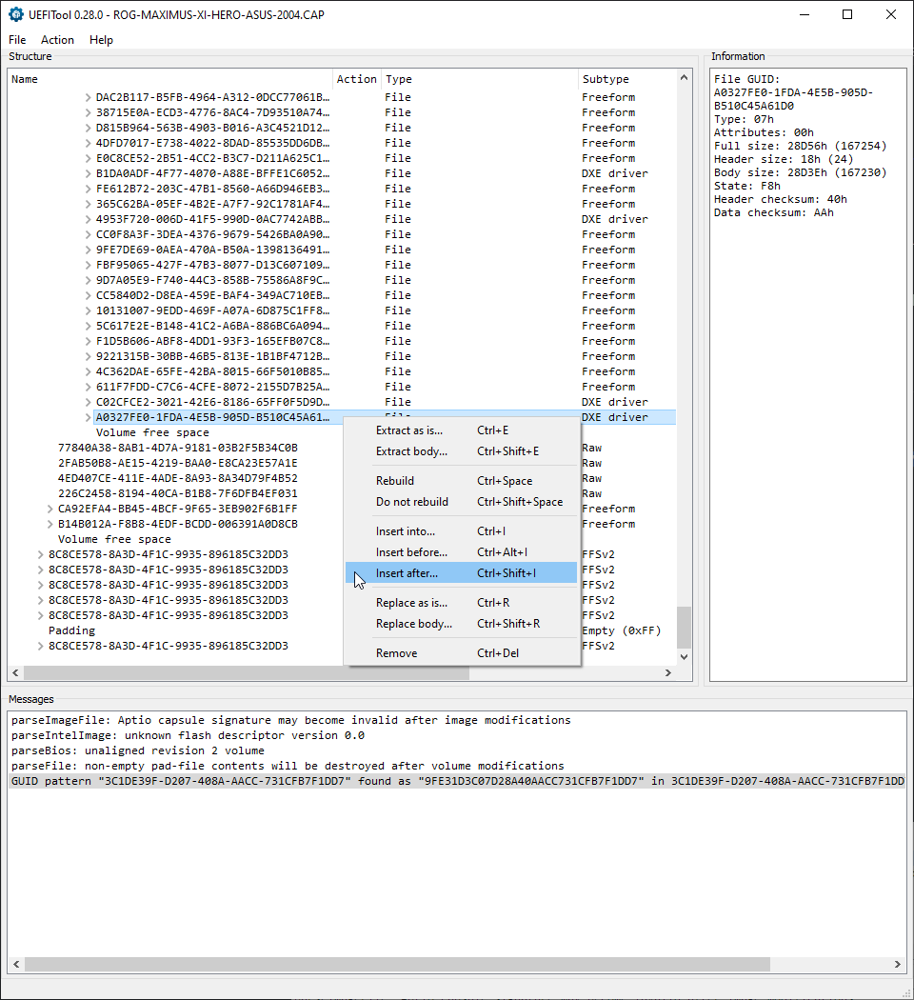
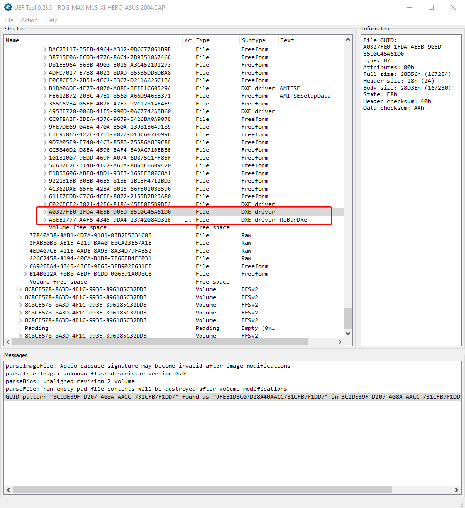

## Background

Resizable BAR (Base Address Register) is a PCIe feature that allows the CPU to access the entire GPU memory at once, rather than in small 256MB chunks. This can provide noticeable performance improvements in modern games and GPU-intensive workloads. However, Intel officially only supports ReBar on 10th gen processors and newer, leaving many perfectly capable systems behind.

My system specs:
- **CPU**: Intel Core i9-9900K
- **GPU**: AMD Radeon RX 7900 XTX
- **OS**: Windows 10
- **Motherboard**: ASUS ROG Maximus XI Hero (Z390 chipset)

Despite AMD's RX 7900 XTX fully supporting ReBar and benefiting significantly from it, Intel's artificial limitation on 9th gen processors meant I couldn't enable this feature through official means.

## The Solution: UEFI Firmware Modification

Thanks to the [ReBarUEFI project](https://github.com/xCuri0/ReBarUEFI), it's possible to inject ReBar support directly into the motherboard's UEFI firmware. This guide covers the UEFITool method, which is the recommended approach.

### Prerequisites

Before starting, gather these requirements:

1. **UEFITool v0.28.0** (non-NE version) - [Download here](https://github.com/LongSoft/UEFITool/releases/tag/0.28.0)
   - Critical: Only version 0.28.0 supports adding modules as of this writing
2. **ReBarDxe.ffs** file from [ReBarUEFI releases](https://github.com/xCuri0/ReBarUEFI/releases)
3. **Your motherboard's latest BIOS file** - Download from manufacturer's website
4. **16GB or smaller USB drive** - Formatted as FAT32 for USB BIOS Flashback
5. **Backup** of your current working BIOS (optional but recommended)

### Visual Walkthrough Overview

The modification process involves four main steps in UEFITool:

1. **Open the BIOS file** - Load your motherboard's `.CAP` firmware file
2. **Search for PciBus module** - Use GUID search to locate the insertion point
3. **Insert ReBarDxe module** - Add the custom driver after the last DXE driver
4. **Verify and save** - Confirm the module appears, then save the modified BIOS

Let's go through each step in detail.

### Step-by-Step Process

#### Step 1: Open Your BIOS File

1. Download your motherboard's latest BIOS file (in my case, the `.CAP` file for ASUS ROG Maximus XI Hero)
2. Launch **UEFITool v0.28.0**
3. Go to **File > Open image file**
4. Select your BIOS file

You should see the BIOS structure loaded in the left panel showing the Aptio capsule.



#### Step 2: Search for the PciBus Module

1. Go to **File > Search** (or press Ctrl+F)
2. In the search dialog:
   - Select **GUID** as the search type
   - Enter: `3C1DE39F-D207-408A-AACC-731CFB7F1DD7`
   - Click **OK**

This GUID identifies the PciBus module in your firmware. Check the **Messages** panel at the bottom - you should see a message like:

```
GUID pattern "3C1DE39F-D207-408A-AACC-731CFB7F1DD7" found as "9FE31D3C07D28A48A0ACC731CFB7F1DD7"
in 3C1DE39F-D207-408A-AACC-731CFB7F1DD
```

**Important**: If you get 2 results, you'll need to add the ReBarDxe module to both volumes. Some BIOS files contain multiple DXE driver volumes.



#### Step 3: Locate the Insertion Point

After the search completes:

1. Expand the firmware tree structure in the left panel
2. Scroll down through the DXE driver files until you reach the bottom
3. Look for the **last DXE driver module** before "Volume free space"
4. In my case on the Maximus XI Hero, this was the file ending with `...B510C45A61D0`

The structure should show many files with type "DXE driver" in the Subtype column.



#### Step 4: Insert the ReBarDxe Module

1. Right-click on the **last DXE driver module** (the one just before "Volume free space")
2. Select **Insert after...** from the context menu
3. Browse to your downloaded **ReBarDxe.ffs** file
4. Click **Open**

You should now see two new entries added to the firmware:
- `A8327F8B-1FDA-4E5B-905D-B510C45A61D0` (DXE driver)
- `A8EE1777-A4F5-4345-9DA4-13742084D31E` (DXE driver - ReBarDxe)

The "ReBarDxe" text should be visible in the Text column for the newly inserted module.



#### Step 5: Save the Modified BIOS

1. Go to **File > Save image file**
2. Choose a descriptive filename (e.g., `ROG-MAXIMUS-XI-HERO-ASUS-2004-REBAR.CAP`)
3. Save to a safe location

UEFITool will warn you about potential signature issues - this is expected when modifying firmware.

#### Step 6: Backup Your Current BIOS Settings

**IMPORTANT**: Flashing the BIOS will reset ALL settings to defaults. Before proceeding:

1. Enter your current BIOS/UEFI settings
2. Take screenshots of all your custom settings (XMP profile, fan curves, boot order, etc.)
3. Alternatively, use the BIOS's "Save & Exit" feature to export settings to a USB drive (if available)
4. Document any important settings you've customized

You'll need to reconfigure everything after flashing, so thorough documentation is crucial.

#### Step 7: Apply UEFI Patches

The modified BIOS now contains the ReBar driver, but you'll need to apply additional UEFI patches to fully enable the feature. Follow the [UEFI patching guide](https://github.com/xCuri0/ReBarUEFI/wiki/UEFI-Patching) from the ReBarUEFI wiki.

#### Step 8: Flash the Modified BIOS Using USB BIOS Flashback

**CRITICAL WARNING**: Flashing a modified BIOS carries inherent risks. On ASUS motherboards, you MUST use USB BIOS Flashback - do NOT use EZ Flash utility.

**Why USB BIOS Flashback?**
- EZ Flash validates BIOS signatures and will reject modified firmware
- USB BIOS Flashback bypasses signature checks, allowing custom firmware
- The Maximus XI Hero has a dedicated Flashback button for this purpose

**Flashing Process:**

1. Prepare a **16GB or smaller USB drive** (recommended for maximum compatibility - some boards have issues with larger drives)
2. Format the USB drive as **FAT32**
3. Copy your modified `.CAP` file to the root of the USB drive
4. Rename it to the exact filename required by your board (check manual - usually something like `M11H.CAP`)
5. Power off your PC completely
6. Insert the USB drive into the designated USB BIOS Flashback port (usually labeled with a white outline on the rear I/O)
7. Press and hold the **USB BIOS Flashback button** on the rear I/O panel
8. The LED should start blinking, indicating the flash process has started
9. Wait for the LED to stop blinking (typically 3-5 minutes)
10. Once complete, the LED will turn off or stay solid
11. Remove the USB drive and power on the system

**Important Notes:**
- **Use a 16GB or smaller USB stick** - larger drives may cause compatibility issues with BIOS Flashback
- Ensure the USB drive is formatted as FAT32 (not exFAT or NTFS)
- Do NOT power off or reset during the flash process
- If flash fails, you can repeat the process with stock BIOS to recover

#### Step 9: Reconfigure BIOS Settings and Enable ReBar

**After flashing, all BIOS settings will be reset to defaults.** When you first boot:

1. Enter your motherboard's BIOS/UEFI settings (usually by pressing Delete or F2)
2. **Restore your previous settings** using your screenshots/notes:
   - Enable XMP/DOCP for RAM overclocking
   - Reconfigure fan curves
   - Set boot order
   - Adjust any other custom settings you documented
3. **Enable ReBar-specific settings**:
   - Navigate to Advanced > PCI Subsystem Settings (or similar)
   - Set **Above 4G Decoding** to **Enabled**
   - Set **Re-Size BAR Support** to **Enabled** (this option will only appear after Above 4G is enabled)
4. Save changes and exit (F10)
5. System will reboot

**Note**: Above 4G Decoding must be enabled first before the Resizable BAR option becomes available in the BIOS menu.

#### Step 10: Verify ReBar is Active

In Windows:

1. Open **Device Manager**
2. Expand **Display adapters**
3. Right-click your GPU > **Properties**
4. Go to **Resources** tab
5. Look for "Large Memory Range" - if ReBar is working, you should see the full VRAM size (24GB for RX 7900 XTX)

Alternatively, use GPU-Z to check the "Resizable BAR" status.

## Troubleshooting

### BIOS Won't Boot After Flashing

- Try clearing CMOS
- Use motherboard's BIOS recovery feature if available
- Flash back to stock BIOS from USB (if your board supports BIOS Flashback)

### ReBar Option Not Appearing in BIOS

- Ensure you modified all DXE volumes if multiple were found
- Verify UEFI patches were applied correctly
- Check if CSM (Compatibility Support Module) is disabled

### System Instability

- Some older motherboards may not handle ReBar well
- Try enabling only "Above 4G Decoding" first
- Update motherboard chipset drivers

## Conclusion

Enabling Resizable BAR on "unsupported" hardware like the 9900K demonstrates the arbitrary nature of some vendor limitations. The hardware is fully capable - it just required UEFI firmware modification to unlock the feature.

The UEFITool method is straightforward and has worked reliably on my system. If you have a 9th gen Intel system or other "unsupported" hardware with a modern GPU, this modification can unlock the feature that would otherwise be artificially locked out.

## Resources

- [ReBarUEFI Project](https://github.com/xCuri0/ReBarUEFI)
- [UEFITool Method Guide](https://github.com/xCuri0/ReBarUEFI/wiki/Adding-FFS-module#uefitool-method-recommended)
- [UEFITool v0.28.0](https://github.com/LongSoft/UEFITool/releases/tag/0.28.0)
- [UEFI Patching Guide](https://github.com/xCuri0/ReBarUEFI/wiki/UEFI-Patching)

**Disclaimer**: Modifying BIOS firmware carries risks. Proceed at your own risk and ensure you understand the process before attempting it. Always have a backup plan for BIOS recovery.
